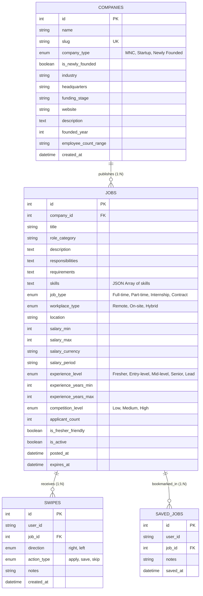

# 📖 SwipeX — Data Dictionary & Schema Documentation (Milestone 2)

> **Module:** Job & Data Intelligence Service  
> **Author:** Shubham Ugale (`Data & Job Intelligence`)  
> **Status:** Milestone 2 Production-Ready  
> **Database:** PostgreSQL / SQLite (Development) with Redis Cache  

---

## 1. Database Architecture Overview

The SwipeX data layer is designed for high-throughput swipe recording, rapid faceted job discovery, and sub-millisecond feed delivery.

---

## 2. Table Specifications

### 2.1 `companies` Table
Stores registered employers across global MNCs, high-growth startups, and early-stage AI ventures.

| Column | Type | Constraints | Description |
|---|---|---|---|
| `id` | `INTEGER` | Primary Key, Auto-increment | Unique identifier for the company |
| `name` | `VARCHAR(255)` | Not Null, Indexed | Official company name |
| `slug` | `VARCHAR(255)` | Unique, Not Null, Indexed | URL-friendly unique identifier |
| `company_type` | `VARCHAR(50)` | Not Null, Indexed | Enum: `MNC`, `Startup`, `Newly Founded` |
| `is_newly_founded` | `BOOLEAN` | Not Null, Default `False`, Indexed | Quick flag for early-stage startup discovery |
| `industry` | `VARCHAR(100)` | Not Null, Indexed | Primary sector (e.g. Fintech, AI, E-commerce) |
| `headquarters` | `VARCHAR(255)` | Not Null | Primary corporate or regional hub |
| `funding_stage` | `VARCHAR(50)` | Nullable | Funding bracket (e.g., Seed, Series A, Public) |
| `website` | `VARCHAR(500)` | Nullable | Corporate URL or careers portal |
| `description` | `TEXT` | Nullable | Company background and engineering mission |
| `founded_year` | `INTEGER` | Nullable | Year of inception |
| `employee_count_range` | `VARCHAR(50)` | Nullable | Size bracket: `1-20`, `50-200`, `10000+` |
| `created_at` | `DATETIME` | Not Null, Default `UTC_NOW` | Timestamp of record creation |

---

### 2.2 `jobs` Table
Stores detailed job descriptions, compensation, required skills, and competition metrics.

| Column | Type | Constraints | Description |
|---|---|---|---|
| `id` | `INTEGER` | Primary Key, Auto-increment | Unique job posting ID |
| `company_id` | `INTEGER` | Foreign Key (`companies.id`), Indexed | Employer publishing this opening |
| `title` | `VARCHAR(255)` | Not Null, Indexed | Job title (e.g., "Full Stack Developer") |
| `role_category` | `VARCHAR(100)` | Nullable, Indexed | Functional department (`Backend`, `Frontend`, `AI/ML`) |
| `description` | `TEXT` | Not Null | Complete role overview |
| `responsibilities` | `TEXT` | Nullable | Bulleted day-to-day deliverables |
| `requirements` | `TEXT` | Nullable | Qualifications and prerequisite experience |
| `skills` | `TEXT` | Not Null, Default `'[]'` | JSON serialized list of skills |
| `job_type` | `VARCHAR(50)` | Not Null, Indexed | Enum: `Full-time`, `Part-time`, `Internship`, `Contract` |
| `workplace_type` | `VARCHAR(50)` | Not Null, Indexed | Enum: `Remote`, `On-site`, `Hybrid` |
| `location` | `VARCHAR(255)` | Not Null, Indexed | Job city / country |
| `salary_min` | `INTEGER` | Nullable, Indexed | Lower bound salary in currency unit |
| `salary_max` | `INTEGER` | Nullable, Indexed | Upper bound salary in currency unit |
| `salary_currency` | `VARCHAR(10)` | Not Null, Default `'INR'` | ISO Currency code (`INR`, `USD`) |
| `salary_period` | `VARCHAR(20)` | Not Null, Default `'Per Annum'` | Frequency (`Per Annum`, `Per Month`) |
| `experience_level` | `VARCHAR(50)` | Not Null, Indexed | Enum: `Fresher`, `Entry-level`, `Mid-level`, `Senior` |
| `experience_years_min` | `INTEGER` | Not Null, Default `0` | Minimum required experience in years |
| `experience_years_max` | `INTEGER` | Not Null, Default `2` | Maximum target experience in years |
| `competition_level` | `VARCHAR(50)` | Not Null, Indexed | Enum: `Low`, `Medium`, `High` |
| `applicant_count` | `INTEGER` | Not Null, Default `0`, Indexed | Number of candidates who swiped right / applied |
| `is_fresher_friendly` | `BOOLEAN` | Not Null, Default `True`, Indexed | Flag for 0-1 yr experience / college graduates |
| `is_active` | `BOOLEAN` | Not Null, Default `True`, Indexed | Visibility status |
| `posted_at` | `DATETIME` | Not Null, Indexed | Publication timestamp |
| `expires_at` | `DATETIME` | Nullable | Auto-closure date |

**Composite Indexes Built for High Query Velocity:**
- `ix_jobs_type_location` ON `(job_type, location)`
- `ix_jobs_salary_range` ON `(salary_min, salary_max)`
- `ix_jobs_exp_competition` ON `(experience_level, competition_level)`

---

### 2.3 `swipes` Table
Captures user swipe deck gestures.

| Column | Type | Constraints | Description |
|---|---|---|---|
| `id` | `INTEGER` | Primary Key, Auto-increment | Unique swipe record ID |
| `user_id` | `VARCHAR(100)` | Not Null, Indexed | Candidate identity |
| `job_id` | `INTEGER` | Foreign Key (`jobs.id`), Indexed | Swiped job card |
| `direction` | `VARCHAR(20)` | Not Null | `right` (Apply/Save) or `left` (Skip) |
| `action_type` | `VARCHAR(20)` | Not Null | `apply`, `save`, `skip` |
| `notes` | `VARCHAR(500)` | Nullable | Optional candidate notes |
| `created_at` | `DATETIME` | Not Null, Indexed | Timestamp of swipe |

**Constraints:** Unique constraint on `(user_id, job_id)`. Re-swiping updates the direction and timestamp.

---

### 2.4 `saved_jobs` Table
Stores candidates' bookmarked roles.

| Column | Type | Constraints | Description |
|---|---|---|---|
| `id` | `INTEGER` | Primary Key, Auto-increment | Unique saved job ID |
| `user_id` | `VARCHAR(100)` | Not Null, Indexed | Candidate ID |
| `job_id` | `INTEGER` | Foreign Key (`jobs.id`), Indexed | Bookmarked job ID |
| `notes` | `VARCHAR(500)` | Nullable | User private notes |
| `saved_at` | `DATETIME` | Not Null, Indexed | Bookmark timestamp |

---

## 3. Freshness & Competition Intelligence Rules

Implemented in `app/core/intelligence.py`:

### Job Freshness Rules
- `<= 24 Hours`: **"Just Posted"** (`is_fresh = True`)
- `<= 3 Days`: **"Recently Posted"** (`is_fresh = True`)
- `<= 7 Days`: **"This Week"** (`is_fresh = True`)
- `> 7 Days`: **"Active"** (`is_fresh = False`)

### Competition Level Rules
- `< 25 Applicants`: **"Low"** (`is_early_applicant = True` if `< 15 applicants`)
- `25 to 100 Applicants`: **"Medium"**
- `> 100 Applicants`: **"High"**
- **Competition Score:** `min(100.0, round((applicant_count / 150.0) * 100.0, 1))`

---

## 4. Milestone 3 Handoff Notes (For Intern 4: AI/ML & Resume ATS Engine)

1. **Feature Vectors for Embedding / TF-IDF:**
   - Text fields to vectorize: `Job.title` + `Job.role_category` + `Job.description` + `Job.skills`.
   - `Job.skills` is structured JSON array (e.g. `["Python", "FastAPI", "Docker"]`).
2. **Implicit User Preference Feedback:**
   - Query `swipes` table where `user_id = :target` and `direction = 'right'` for positive training samples.
   - Query `direction = 'left'` as negative training samples for collaborative filtering.
3. **Hard Constraint Filtering:**
   - Filter jobs on `Job.experience_years_min <= candidate.experience_years`.
   - Consider `Job.workplace_type` against candidate's remote preferences.
